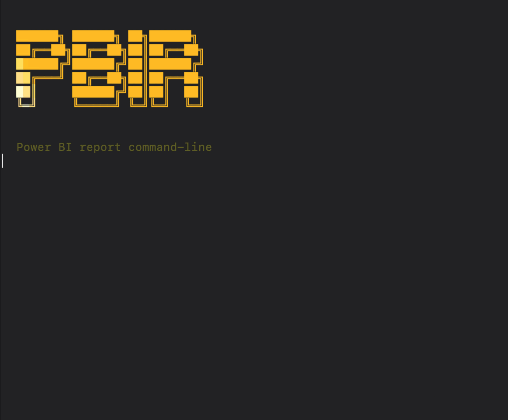

<p align="center">
  
</p>

<h1 align="center">pbir.tools</h1>

<p align="center">
  <strong>CLI tools for Power BI report automation</strong>
</p>

<p align="center">
  Browse, edit, validate, and publish PBIR reports from the terminal.
</p>

> [!WARNING]
> `pbir.tools` is in beta. Back up reports before large edits, especially bulk formatting, conversion, merge, and publish workflows.

## What You Get

- `pbir`: command-line interface for local PBIR report work
- `pbir setup`: helper for installing assistant-specific instructions and skills

## Install

Download the latest macOS or Windows installer from [GitHub Releases](https://github.com/maxanatsko/pbir.tools/releases).

### macOS

1. Download the installer from Releases and try to open it once.
2. If macOS blocks it because the installer is unsigned or not notarized, open:
   `System Settings` => `Privacy & Security`
3. Scroll down to the `Security` section. You should see a message about the blocked installer there.
4. Click `Open Anyway`.
5. When macOS asks again, click `Open` and finish the installation.

### Windows

1. Download the installer from Releases and run it.
2. If Windows Defender SmartScreen shows `Windows protected your PC`, click `More info`.
3. Confirm the installer name, then click `Run anyway`.
4. Finish the installation.

After installation, open a new terminal and verify:

```bash
pbir --version
```

## Quick Start

```bash
pbir ls
pbir tree "Sales.Report" -v
pbir model "Sales.Report" -d
pbir add visual card "Sales.Report/Overview.Page" --title "Revenue" -d "Values:Sales.Revenue"
pbir validate "Sales.Report"
```

`pbir` works with PBIR-format reports stored as folders, using paths like:

```text
Report.Report/Page.Page/Visual.Visual
```

## AI Assistants

If you use an assistant locally, `pbir setup` can install assistant-specific files for Claude Code, Cursor, Copilot, Gemini CLI, and Pi:

```bash
pbir setup --claude-code
pbir setup --cursor
pbir setup report "Sales.Report" --claude-hooks
```

`pbir script` also exists as an advanced Python-based escape hatch for custom automation. It is intentionally not the main public workflow and is only mentioned briefly in the CLI operations docs.

## Documentation

| Area | What it covers |
|---|---|
| [Getting Started](getting-started.md) | Install, terminal basics, first 5 minutes |
| [CLI Docs](cli/README.md) | Command groups and task-based CLI reference |
| [CLI Workflows](cli/workflows.md) | End-to-end report workflows |

## Safety

- Run `pbir backup "Report.Report"` before larger edits.
- Run `pbir validate "Report.Report"` after every mutation.
- Use `-f` only when you intend bulk or destructive operations.
- Treat publish, convert, merge, and split commands as higher-risk workflows.

## Support

- Run `pbir --help` for the top-level CLI surface.
- Run `pbir <command> --help` for command-specific usage.
